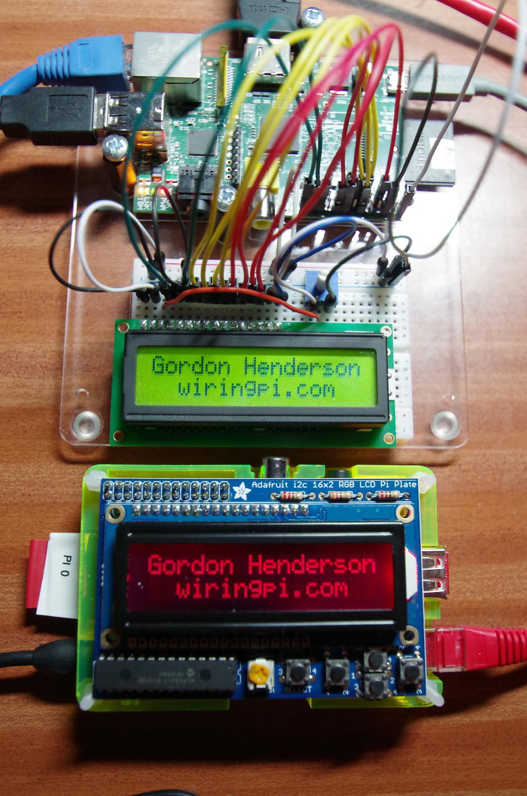
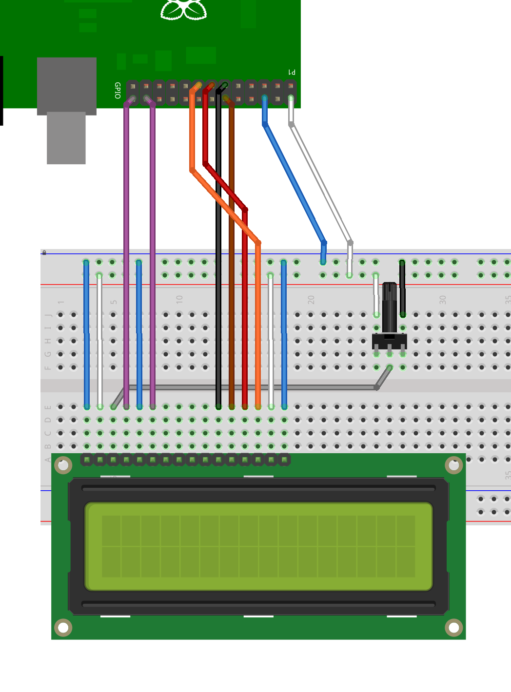
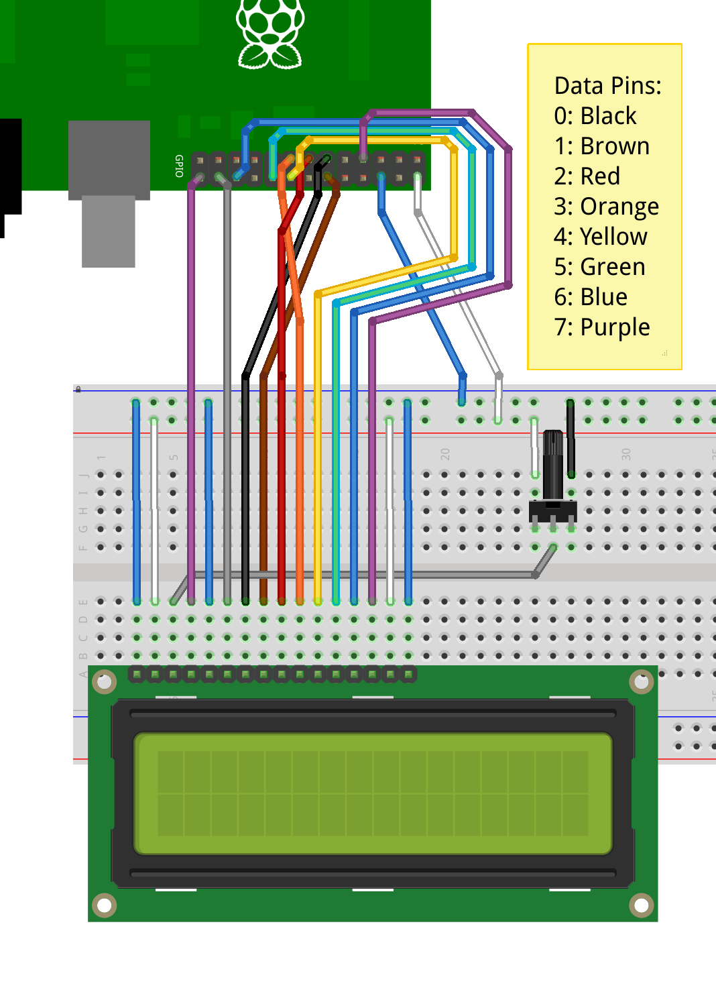

LCD Library (HD44780U)
The wiringPi LCD devLib allows you to drive most of the popular 1, 2 and 4-line LCD displays that are based on the  Hitachi HD44780U or compatible controllers.

It allows you to connect multiple displays to a single Raspberry Pi. The displays can be connected directly to the Pi’s on-board GPIO or via the many GPIO expander chips supported by wiringPi – e.g. the MCP23017 I2C GPIO expander (e.g. as used on some of the Adafruit boards)

displaysTop: standard 16×2 LCD display connected directly to a Raspberry Pi and (below) an Adafruit RGB back-lit LCD plate with control buttons. See this page for more details of the Adafruit display setup using wiringPi

The following Fritzing diagrams describe how to connect the displays directly to the on-board GPIO of a Raspberry Pi in both 8 and 4-bit modes:

LCD Connected to Pi in 4-bit mode

LCD Connected to a Pi in 4-bit pode

LCD connected to Pi in 8-bit mode

LCD connected to a Pi in 8-bit mode

The library is simple to use in your own programs, however wiring the displays up may be challenging, so do take care.

It is possible to wire up more than one display. In 8-bit mode, the first display needs 10 GPIO pins and each additional display needs just one more pin, so with a maximum of 17 GPIO pins, that’s 8 displays. If you move to using a 4-bit interface (trivial in the code), then it’s 4 more displays – 12 LCDs! However I suspect the rest of the wiring might be somewhat challenging… Wiring is described at the end of the this page.

The LCD display can be either a 5V display or a 3,3v display, however if we are using a 5V display then we must make absolutely sure the display can never write data back to the Raspberry Pi, otherwise it will present 5V on the Pi’s GPIO pins which will not be good. At best you’ll destroy the pin drivers, at worst you’ll destroy your Pi.

When using a 5v display, make sure you always connect the R/W pin on the display to ground to force the display to be read-only to the host. If not, the display can potentially present 5v back to the Pi which is potentially damaging.

Initialisation and Usage
To use the LCD library, you’ll need this at the start of your program:

#include <wiringPi.h>
#include <lcd.h>
First, you need to initialise wiringPi in the way you want to. The LCD library will call pinMode functions as required.

int  lcdInit (int rows, int cols, int bits, int rs, int strb,
        int d0, int d1, int d2, int d3, int d4, int d5, int d6, int d7) ;
This is the main initialisation function and must be called before you use any other LCD functions.

Rows and cols are the rows and columns on the display (e.g. 2, 16 or 4,20). Bits is the number of bits wide on the interface (4 or 8). The rs and strb represent the pin numbers of the displays RS pin and Strobe (E) pin. The parameters d0 through d7 are the pin numbers of the 8 data pins connected from the Pi to the display. Only the first 4 are used if you are running the display in 4-bit mode.

The return value is the ‘handle’ to be used for all subsequent calls to the lcd library when dealing with that LCD, or -1 to indicate a fault. (Usually incorrect parameters)

In the above Fritzing diagrams, the 4-bit one would be initialised by:

fd = lcdInit (2, 16, 4,  11,10 , 0,1,2,3,0,0,0,0) ;
and the 8-bit one by:

fd = lcdInit (2, 16, 8,  11,10 , 0,1,2,3,4,5,6,7) ;
Functions
lcdHome (int handle)
lcdClear (int handle)
These home the cursor and clear the screen respectively.

lcdDisplay (int fd, int state) ;
lcdCursor (int fd, int state) ;
lcdCursorBlink (int fd, int state) ;
These turn the display on or off, turn the cursor on or off and the cursor blink on or off. The state parameter is True or False. The initial settings are display on, cursor off and cursor blink off.

lcdPosition (int handle, int x, int y) ;
Set the position of the cursor for subsequent text entry. x is the column and 0 is the left-most edge. y is the line and 0 is the top line.

lcdCharDef (int handle, int index, unsigned char data [8]) ;
This allows you to re-define one of the 8 user-definable chanracters in the display. The data array is 8 bytes which represent the character from the top-line to the bottom line. Note that the characters are actually 5×8, so only the lower 5 bits are used. The index is from 0 to 7 and you can subsequently print the character defined using the lcdPutchar() call.

lcdPutchar (int handle, unsigned char data) ;
lcdPuts (int handle, const char *string) ;
lcdPrintf (int handle, const char *message, …) ;
These output a single ASCII character, a string or a formatted string using the usual printf formatting commands.

At the moment, there is no clever scrolling of the screen, but long lines will wrap to the next line, if necessary.

Do see the example program lcd.c in the examples directory inside the wiringPi software distribution.

Connecting them up:
Connecting up displays is relatively straight forward. You pick 4 or 8 GPIO pins for the data bus, then 2 more pins for the control. The LCDs have 2 control wires labeled RS and E. the E pin is what we refer to as the strobe pin above.

When using a 5v display, make sure you always connect the R/W pin on the display to ground to force the display to be read-only to the host. If not, the display can potentially present 5v back to the Pi which is potentially damaging.

You refer to the diagram of the edge connector on the LCD and use that to hook up the pins on the GPIO connector. Use the diagram here to help you keep track of the GPIO pins you are using.

For a 2nd (or 3rd, etc.) display, you wire the displays in parallel, connecting up all the same pins with the exception of the E pin. Each display needs its own unique E pin connected back to a different GPIO pin.