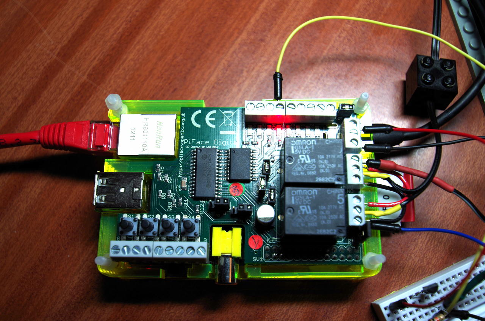

PiFace
WiringPi supports a devLib module for the PiFace board.

The PiFace is an IO expansion board for the Raspberry which features 8 open collector outputs, 2 relays and 8 inputs. The 8 inputs can actually be re-provisioned as outputs but you need to be aware that they have on-board 330Ω resistors and you’ll need to use the generic MCP23s17 wiringPi expansion module rather than the PiFace expansion module described here.

See my quick review here for more details about the PiFace.

Include
#include <wiringPi.h>
#include <piFace.h>
Initialise
piFaceSetup (int pinBase) ;
pinBase is the base pin that you want your PiFace to appear as – the examples provided use 200 as the base pin. The setup assigns 32 pins, although the way it works is to overlay the 8 input pins with the 8 output pins. So you read from pin base + 0 to read the first input pin, and write to base + 0 to write to the first output pin.

To read the state of the output latch, read from pin + 8 + outputPin. The remaining 16 pins are used by the underlying MCP23S17 driver and should not be used directly.

pifacePiFace board on-top of a Raspberry Pi (sitting inside half a Pibow case)

The usual “blink” program for the PiFace looks like:

/*
 * blink.c:
 *      Simple "blink" test for the PiFace interface board.
  ***********************************************************************
 */

#include <stdio.h>

#include <wiringPi.h>
#include <piFace.h>

// Use 200 as the pin-base for the PiFace board, and pick a pin
//      for the LED that's not connected to a relay

#define PIFACE  200
#define LED     (PIFACE+2)

int main (int argc, char *argv [])
{
  printf ("Raspberry Pi PiFace Blink\n") ;
  printf ("=========================\n") ;

// Always initialise wiringPi. Use wiringPiSys() if you don't need
//      (or want) to run as root

  wiringPiSetupSys () ;

// Setup the PiFace board

  piFaceSetup (PIFACE) ;

  for (;;)
  {
    digitalWrite (LED, HIGH) ;  // On
    delay (500) ;               // mS
    digitalWrite (LED, LOW) ;   // Off
    delay (500) ;
  }

  return 0 ;
}
Notes
The PiFace uses the MCP23S17 SPI GPIO expansion chip so you need to load the SPI kernel driver first. Use the gpio command: gpio load spi
If you want to use the input pins as outputs, then you need to use the mcp23s17 expansion module for wiringPI instead of the piFace expansion. Then setting up is relatively straighforward – pins 0 through 7 are the output pins, and 8 through 15 are the normal input pins which you can use pinMode() on to change to outputs, if required.
The gpio command supports the PiFace board directly using the -p flag, but assumes the pin-base is 200. So gpio -p write 200 1 will set the first output pin high – that’s the first relay.