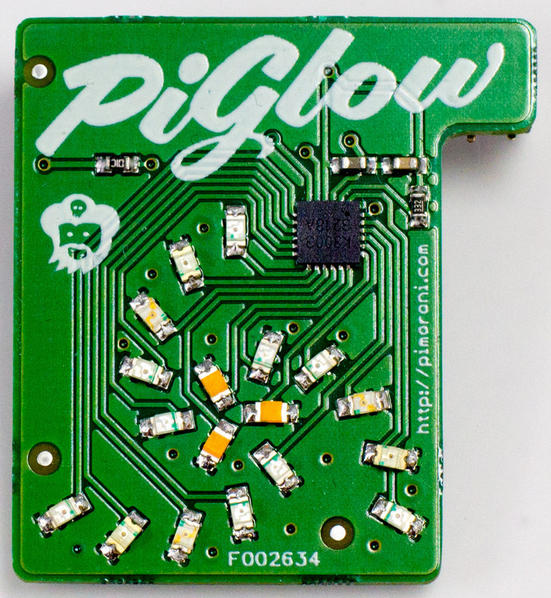

PiGlow
WiringPi supports a devLib extension to allow you to use the PiGlow add on board from Pimoroni.

piglow

ThePiGlow board has an SN3218 I2C LED controller and 18 LEDs arranged in 3 “legs” of 6 LEDs. (or 6 “rings” of 3 LEDs) The LED colours in each leg match and are in the order Red (at the outside), Yellow, Orange, Green, Blue and White (in the center)

The devLib driver allows you to select the brightness of an individual LED, a “leg” or a “ring”.

Include
#include <wiringPi.h>
#include <piGlow.h>
Initialise
piGlowSetup (int clear) ;
This initialises the PiGlow devLib software. You need to make sure the I2C kernel module is pre-loaded and if you have not used the gpio program to load it, then you may have to run your program as root (ie. with sudo)

The clear parameter is TRUE or FALSE. If TRUE, then all the LEDs will be turned off to start with.

Use
void piGlowRing  (const int ring, const int intensity) ;
This will light up all 3 LEDs on the given ring at the given intensity – 0 (off) to 255 (really bright!) The ring number is 0 from the outside to 5 for the inside.

You can use the constants:

PIGLOW_RED, PIGLOW_YELLOW, PIGLOW_ORANGE, PIGLOW_GREEN, PIGLOW_BLUE or PIGLOW_WHITE.

piglowRing (PIGLOW_ORANGE, 60) ;
will light up the 3 orange LEDs with an intensity of 60.

void piGlowLeg   (const int leg,  const int intensity) ;
This will light up all 6 LEDs on the given led (0, 1 or 2) to the supplied intensity. The leg number will depend on which way up you have the Pi, but leg 0 is normally the one that points to the same edge the composite video connector in on, 1 is to the right (clockwise) and 2 is to the left (anticlockwise)

void piGlow1     (const int leg,  const int ring, const int intensity) ;
This lights up an individual LED to the intensity given. The leg and ring parameters specify the LED to set.

Examples
Look in the wiringPi/examples/PiGlow directory for some example programs including a simple piglow utility. Compile these by typing make as usual. the piGlow1 program is the ones used in the video below.

The piglow utility allows for simple command-line control:

piglow off         # All off
piglow red 50      # Light the 3 red LEDs to 50%
piglow all 75      # Light all to 75%
piglow leg 0 25    # Light leg 0 to 25%
piglow ring 3 100  # Light ring 3 to 100%
piglow led 2 5 100 # Light the single LED on Leg 2, ring 5 to 100%
You could install the piglow command in /usr/local/bin/ so you could use it at any time. (sudo make install will do this for you)

Notes
You need to load the I2C kernel modules before you can use I2C devices. Use the gpio command: gpio load i2c
If this is the only I2C device on your Pi (and it almost certianly will be unless you’re using some sort of break-out connector!), then it will run at 400KHz, so try: gpio load i2c 400
Use the i2cdetect program to scan your I2C bus to make sure the Pi can see the SN3218 which will show up as 0x54.
If you have a Rev 1 Pi, then the i2cdetect command is: i2cdetect -q -y 0 if you have a Rev. 2 Pi, then use i2cdetect -q -y 1
The gpio command supports the i2cdetect command and automatically caters for board revision. Simply type: gpio i2cd
The wiringPi SN3218 driver knows which revision Pi you have, so you know need to take any special precautions – your code will work on either a Revision 1 or 2 Pi.
Internally the PiGlow devLib extension adds 18 more pins to wiringPi’s pin map. These pin are normally at location 577. This should not be an issue as the PiGlow is designed to be the only peripheral on the Pi, but if you have used a breakout board to add other devices to it, then you should pick a pinBase that’s outside the range 577 through 595.
Video demonstration:

