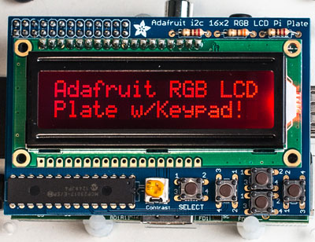
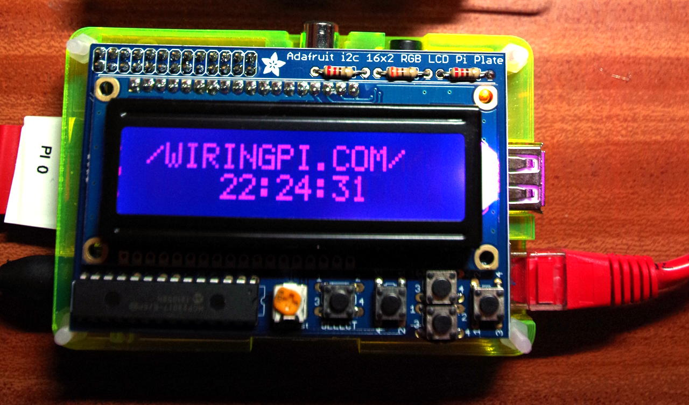

Adafruit RGB LCD Plate and wiringPi
The Adafruit RGB LCD plate is a nice little display which adds 5 push-buttons to the display board, and sits on-top of the Raspberry Pi. The RGB part refers to the backlight – which, as you’ve guessed can be set to various colours by combining the red, green and blue backlights.

Adafruit RGB LCD Plate w/Keypad

I chose it to use as a bit of a test-bed to make sure that one of the existing devLibs – the LCD character driver should work not only with the Pi’s on-board GPIO, but through a GPIO expander chip – the Adafruit display uses the MCP23017 I2C GPIO expander chip.

It comes as a kit to be soldered and there weren’t any real issues – although the one thing that I find annoying was that the holes in the PCB for the 3 resistors were slightly wider than the resistor with the legs bent close to it – necessitating some small adjustments! A minor niggle though.

So with that in-mind, a quick modification to my existing lcd.c test program and it was running almost immediately without any hitches.

Once I’d soldered it and checked to make sure no solder bridges, etc. I plugged it in and loaded up the I2C driver to see if I could see it:

gpio load i2c
gpio i2cd
and I saw the MCP23017 at its default address of 0x20. (There are solderable jumpers under the board to change this if required)

     0  1  2  3  4  5  6  7  8  9  a  b  c  d  e  f
00:          -- -- -- -- -- -- -- -- -- -- -- -- -- 
10: -- -- -- -- -- -- -- -- -- -- -- -- -- -- -- -- 
20: 20 -- -- -- -- -- -- -- -- -- -- -- -- -- -- -- 
30: -- -- -- -- -- -- -- -- -- -- -- -- -- -- -- -- 
40: -- -- -- -- -- -- -- -- -- -- -- -- -- -- -- -- 
50: -- -- -- -- -- -- -- -- -- -- -- -- -- -- -- -- 
60: -- -- -- -- -- -- -- -- -- -- -- -- -- -- -- -- 
70: -- -- -- -- -- -- -- --
I consulted the schematic to work out the pin assignments on the device – the display is connected up on 4-bit mode and the display control signals, buttons, and the LED outputs taking up almost all the other 16 GPIO pins.

Some quick testing using the GPIO command to verify I’d interpreted it OK:

gpio -x mcp23017:100:0x20 mode 106 out
gpio -x mcp23017:100:0x20 write 106 0
and the Red backlight LED came on. (It seems the backlight uses negative logic) Similarly for the green and blue:

gpio -x mcp23017:100:0x20 mode 107 out # Green
gpio -x mcp23017:100:0x20 write 107 0
gpio -x mcp23017:100:0x20 mode 108 out # Blue
gpio -x mcp23017:100:0x20 write 108
Next, a quick modification to my existing lcd.c test program and it was running almost immediately without any hitches.

So to make it work with wiringPi v2, it’s just a matter of setting up the mcp23017 as an extension module, then using the new pins defined for the display itself:

// Defines for the Adafruit Pi LCD interface board

#define AF_BASE         100
#define AF_RED          (AF_BASE + 6)
#define AF_GREEN        (AF_BASE + 7)
#define AF_BLUE         (AF_BASE + 8)

#define AF_E            (AF_BASE + 13)
#define AF_RW           (AF_BASE + 14)
#define AF_RS           (AF_BASE + 15)

#define AF_DB4          (AF_BASE + 12)
#define AF_DB5          (AF_BASE + 11)
#define AF_DB6          (AF_BASE + 10)
#define AF_DB7          (AF_BASE +  9)

#define AF_SELECT       (AF_BASE +  0)
#define AF_RIGHT        (AF_BASE +  1)
#define AF_DOWN         (AF_BASE +  2)
#define AF_UP           (AF_BASE +  3)
#define AF_LEFT         (AF_BASE +  4)
Setup:

  mcp23017Setup (AF_BASE, 0x20) ;
  lcd = lcdInit (2, 16, 4, AF_RS, AF_E, AF_DB4,AF_DB5,AF_DB6,AF_DB7, 0,0,0,0) ;
That’s enough to get the display going, but we really need to turn the backlight on and put the button pins into input mode with the internal pull-ups enabled – the buttons short to 0v.

Please do see the program source to see how the backlight is setup and the buttons read, but there is nothing special to reading them – e.g. I modified the code that waits for the Enter key to be pressed in the original to wait for the “Select” button on the display:

static void waitForEnter (void)
{
  printf ("Press SELECT to continue: ") ; fflush (stdout) ;

  while (digitalRead (AF_SELECT) == HIGH)       // Wait for push
    delay (1) ;

  while (digitalRead (AF_SELECT) == LOW)        // Wait for release
    delay (1) ;

  printf ("OK\n") ;
}
(it could probably be done better and with some debouncing, but for this little demo, that’s more than sufficient – demonstrating that a simple digitalRead() function call is all you need to read the button via wiringPi which has the mcp23017 registered with it).

The demo program uses the up/down buttons to cycle through the LED colours – from Off to Red, Green, Yellow, Blue, Purple, Cyan and finally White.

adaLcdThe Adafruit LDC plate on a Raspberry Pi in 5/8th of a Pibow case.