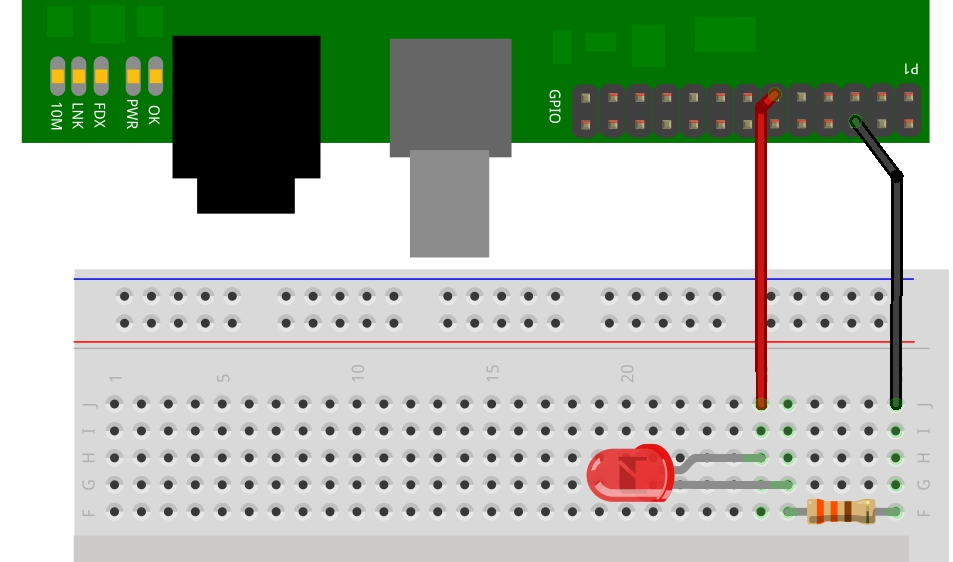

# Blink

Blink is the “Hello World” of the GPIO interfacing world. It’s the simplest program and circuit that lets you see something happening.

If you have the following saved in a file called blink.c:

```c
#include <wiringPi.h>
int main (void)
{
  wiringPiSetup () ;
  pinMode (0, OUTPUT) ;
  for (;;)
  {
    digitalWrite (0, HIGH) ; delay (500) ;
    digitalWrite (0,  LOW) ; delay (500) ;
  }
  return 0 ;
}
```

 then to compile and run, you would enter:

```Shell
gcc -Wall -o blink blink.c -lwiringPi
sudo ./blink
```

 To see the output of this, you would need to connect a single LED to the GPIO connector of the Raspberry Pi as follows:




blink1and if all goes well, you should see the LED flashing once a second.

The LED is any generic LED you may have – typically 5mm diameter and the resistor is 330Ω.

You can find blink.c and others – blink8.c and blink12.c in the examples directory of the wiringPi distribution. To use the makefile to compile them:

```Shell
make blink
make blink8
make blink12
```
