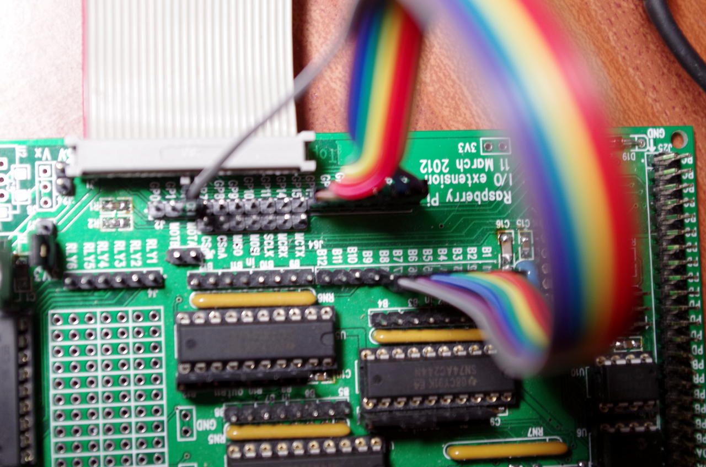

Blink
Blink is the “Hello World” of the microcontroller world. It usually does nothing more than flash an LED or 2.
So, assuming that you have your Pi connected to your Gertboard as described in the first page then we can write our first program for it using wiringPi.

One thing to note: wiringPi has it’s own numbering convention which is somewhat different to the native chip numbers that are on the Pi’s SoC. Traditionally we’d refer to the numbers which are the actual bit positions of the signals inside the internal GPIO registers – this is fine, but on the Pi they are not intuitive and worse, some of them changed from Rev 1 to Rev 2, so from now on I’ll be using the wiringPi numbers, but will indicate their “real” numbers by referring to the BCM_GPIO number. The wiringPi pin numbers remain constant regardless of the board revision.

Our blink program (One LED)
The blink program should be included as part of the wiringPi distribution in the examples directory – it’s reproduced here for convenience though:

#include <stdio.h>
#include <wiringPi.h>

// LED Pin - wiringPi pin 0 is BCM_GPIO 17.

#define LED     0

int main (void)
{
  printf ("Raspberry Pi - Gertboard Blink\n") ;

  wiringPiSetup () ;

  pinMode (LED, OUTPUT) ;

  for (;;)
  {
    digitalWrite (LED, 1) ;     // On
    delay (500) ;               // mS
    digitalWrite (LED, 0) ;     // Off
    delay (500) ;
  }
  return 0 ;
}
The important part is the #include <wiringPi.h> the rest should be fairly straightforward if you have programmed in C or C++ before. To compile and run:

gcc -Wall -o blink blink.c -lwiringPi
sudo ./blink
You need to link with the wiringPi library, hence the -lwiringPi and you also need to be root to run the program, as only root can directly access the GPIO.

The wiringPi functions we are using are:

wiringPiSetup()
This must be called before anything else – it opens the GPIO devices and allows our program to access it.

pinMode()
This set the mode of the pin – usually in or out, but there are some other functions too.

digitalWrite()
Outputs a value (0 or 1) to the given pin.

delay()
This delays for a number of milliseconds.

So there should be nothing out of the ordinary here – and some will be very familiar if you have used an Arduino in the past.

When your program is running, you can press Control-C to stop it and return to command mode.

More LEDs
Now lets wire up 7 more LEDs so we have 8 in total. We’ll wire them from Gertboard pins GP17, GP18, GP21, GP22, GP23, GP24, GP25 and GP4 to B1 through B8 respectively as shown in this table:

J2	<- Jumper Wire ->	J3
GP17	<–>	B1
GP18	<–>	B2
GP21	<–>	B3
GP22	<–>	B4
GP23	<–>	B5
GP24	<–>	B6
GP25	<–>	B7
GP4	<–>	B8
The result should be something like below:

gertb2Gertboard with first 8 pins wired to the buffers and LEDs

I’ve used colour coded cable here, so if you know your resistor colour codes then you may be able to work out which wire is which, however this takes the first 8 GPIO pins on the Pi and connects them to the first 8 buffer inputs.

LED Sequence (8 LEDs)
Look for the blink8.c program in the examples directory.

This program will send a simple sequence to the LEDs. Setting them on one at a time, then turning them off again. As before, compile and run with:

gcc -Wall -o blink8 blink8.c -lwiringPi
sudo ./blink8
Examine the program and note that we’re using wiringPi pin numbers here and that they conveniently map 0 -> 7 to the first 8 GPIO pins.

This is almost as far as we can go with simple LED blink programs – what you should do now is modify these programs an write your own to do some more tasks.

All the wiringPi functions are documented here.