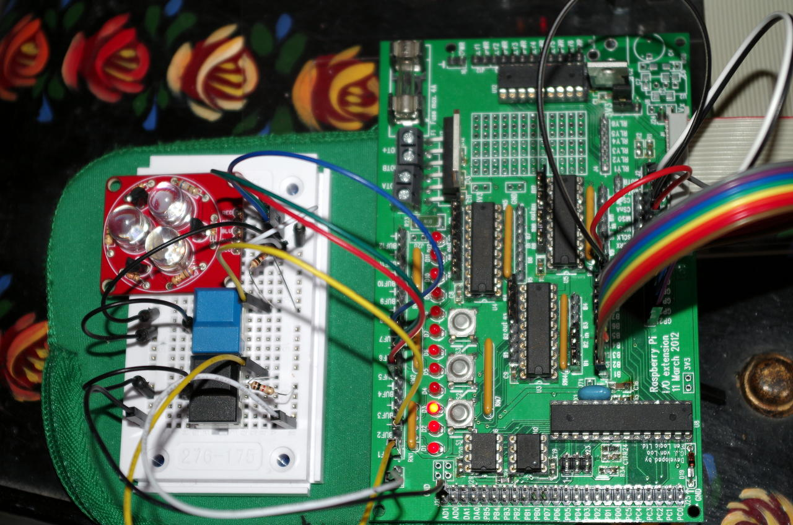
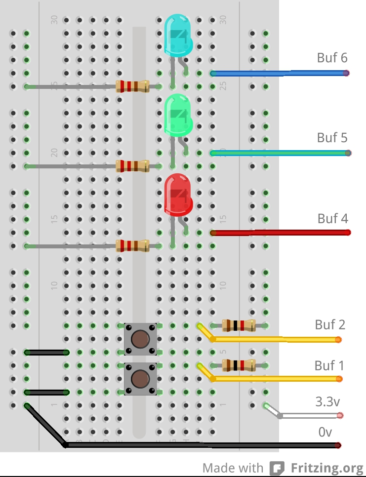

Connecting to the Gertboard
So while the Gertboard has LEDs and buttons, it’s really intended to be used to safely connect your Raspberry Pi to external devices, and to do this we need to look closer at what it provides.

There are 12 buffered pins – these can be individually configured as inputs or outputs. As inputs they take a maximum of 3.3v and as outputs they can source (or sink) a maximum of 20mA each.

Additionally, there are 6 outputs that go to a ULN2803A darlington driver chip. These (open collector) outputs can sink a maximum total current of 500mA. They can be used to drive relays and small motors and small incandescent bulbs.

As well as the 12 buffered pins and 6 higher power outputs, there is a motor driver which is capable of driving a DC brushed motor forwards, backwards or at a variable speed using PWM and there is also an analog to digital converter and a digital to analog converter. We will look at all these in turn.

The buffered input and output pins
These pins are really extensions of the Pi’s own GPIO pins – however they are passed through the 72×244 buffer ICs. This is to act as a protection for the Pi – cheaper to blow up one of these chips than your entire Pi…

They can drive other 3.3v logic devices, small LEDs and sense switches, but remember that they are limited to an input voltage of 3.3v, and an output current of 20mA.

gertboard-out1In this image there are 3 LEDs connected to the Buffer pins Buf4, Buf5 and Buf6, and 2 buttons connected to Buf1 and Buf2. The first 2 buffer Input/Output jumpers have been moved to the input side. The 2 switches have pull-up resistors to the +3.3v line – this is required to stop the inputs to the 74×244 buffer chips from floating when the switch isn’t pushed. The switches connect the input to 0v when pushed – so like the on-board buttons they read high, or logic 1 when not pushed and low/0 when they are pushed. The breadboard picks up 3.3v and 0v from pins on the Gertboard (via the white and black wires)

I’m running same buttons.c program as before, but this time using the buttons on the breadboard to turn the external LEDs on/off – the third button on the Gertboard controls the last LED.

Note that I’m using large LEDs here which require about 80mA each, however they have their own buffer transistors which are being driven by the normal buffered outputs from the Gertboard. You can use regular LEDs, or even a tri-colour LED.

An equivalent layout on the breadboard is shown below:

gertboard1_bb

Summary
The external buffered pins (Buf X) are just like the Pi’s own GPIO pins, but they go via a buffer which can help protect the Pi from mis-use.
Inputs do not have any pull-up’s or pull-down’s so we need to provide this, if required.
Remember to move the buffer Input/Output jumpers to the appropriate side of the 74×244 buffer chips when using the external Buf X pins on the Gertboard.