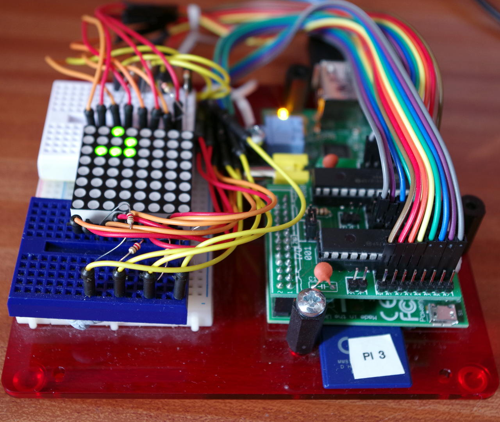

More Testing: Game of Life
I was looking for some more ideas to use to test wiringPi v2 and Amy Mather’s presentation at the Manchester Raspberry Jamboree gave me a great idea – implement John Conways Game of Life on the Pi using some GPIO expander chips and one of those 8×8 LED matrix displays. Amys solution involved an Arduino to drive the LED matrix, but I’ve used a board with 2 x MXP23017 GPIO expanders on it.

So this is my setup:

life1Hopefully Life enthusiasts will recognise the pattern in green dots on that display as a glider – and glide it does as you’ll see in the video below!

Hardware
The setup here has one of John Jays IO expansion boards and it was this that I was looking to test. I’ve already looked at one of his boards some time back but needed an opportunity to test this one – so this board has 2 x MCP23017 I2C GPIO expander chips on it, giving a grand total of 32-bits of GPIO. wiringPi sees this as just another 32 “pins”, no need to poke config registers, etc. with version 2…

The 8×8 display is bi-colour – Green and Red, so needs 24 bits of IO to make it work properly. As usual, I’m optimising the hardware by slightly increasing the complexity of the software, so I only have 8 resistors here on the commons to the bi-colour LEDs – that means I can only effectively light either the Red or the Green LED at any time. In-Theory I can further optimise the software by lighting up to 8 LEDs at a time, but I don’t.

One issue I have found here is the speed (or lack of it!) of the I2C bus… At the default of 100Kb/sec it starts to show up. I did manage to get the clock up to 750Kb/sec though, but faster than that and the I2C bus was unreliable – on the ‘scope it wasn’t rising back up to 3.3v. This may be a simple issue to do with the board though (the MCP23017’s are good to 1.7Mb/sec) so I2C bus speed may well be a factor when you’re looking to use it for your next project…

Here’s a short video of it in action:

You may notice some red leds – I changed the code slightly to show cells that had died in red (for one generation). Adds to the excitement (and I wanted to display the red LEDs too)

The surface is a torus, so it wraps round without any issues and I’m limiting the update rate to 10 a second here.

If you look at the code below you’ll see that the code to output bits on the IO expanders is nothing more than digitalWrite() operations. wiringPi v2 takes care of all the interpretation of the MCP23017’s registers, bits, controls, etc. leaving you to get on with the job of interfacing your hardware!

/*
 * life.c:
 ***********************************************************************
 */

#include <stdio.h>
#include <string.h>
#include <errno.h>
#include <stdlib.h>
#include <stdint.h>

#include <wiringPi.h>
#include <mcp23017.h>

#define ROW_OFFSET      108
#define COL_RED         116
#define COL_GREEN       124

unsigned char matrix [8][8] ;

PI_THREAD (matrixUpdater)
{
  int row, col ;
  unsigned char data ;

  piHiPri (50) ;

  for (;;)
  {
    for (row = 0 ; row < 8 ; ++row)
    {
      digitalWrite (ROW_OFFSET + row, 1) ; 
      for (col = 0 ; col < 8 ; ++col)
      {
        data = matrix [col][row] ;
        /**/ if (data == 0)
          continue ;
        else if (data == 1)     // Green
        {
          digitalWrite (COL_GREEN + col, 0) ; 
          delayMicroseconds (500) ;
          digitalWrite (COL_GREEN + col, 1) ;
        }
        else                    // Red
        {
          digitalWrite (COL_RED + col, 0) ; 
          delayMicroseconds (500) ;
          digitalWrite (COL_RED + col, 1) ;
        }
      }
      digitalWrite (ROW_OFFSET + row, 0) ;
    }
  }

  return NULL ;
}

void setupMatrix (void)
{
  int row, col ;

// We need wiringPi setup in some way to make sure that
//      delay() works, but we don't need to be root to
//      use the I2C, so ...

  wiringPiSetupSys () ;

// Add in the 2 x 23017 GPIO expander from base pin 100

  mcp23017Setup (100, 0x20) ;
  mcp23017Setup (116, 0x21) ;

// Set the pins up as we need it.
//      The first chip has the 2nd port addressing the rows

  for (row = 8 ; row < 16 ; ++row)
  {
    pinMode (100 + row, OUTPUT) ;
    digitalWrite (100 + row, 0) ;
  }

//      and the 2nd chip has the first port connected to the Greens
//      then Reds

  for (col = 16 ; col < 32 ; ++col)
  {
    pinMode (100 + col, OUTPUT) ;
    digitalWrite (100 + col, 1) ;
  }
}

/*
 * torus:
 *      Do the coordinate wrapping for a torus
 *********************************************************************************
 */

void torus (int *x, int *y)
{
  if (*x < 0) *x = *x + 8 ;
  if (*x > 7) *x = *x - 8 ;
  if (*y < 0) *y = *y + 8 ;
  if (*y > 7) *y = *y - 8 ;
}

/*
 * neighbours:
 *      Count our nighbours - this algorithm assumes the world is a torus
 *********************************************************************************
 */

int neighbours (int x, int y)
{
  int sx, sy ;
  int x1, y1 ;
  int count = 0 ;

  for (sx = x - 1 ; sx < x + 2 ; ++sx)
  {
    for (sy = y - 1 ; sy < y + 2 ; ++sy)
    {
      if ((sx == x) && (sy == y))       // don't count myself!
        continue ;

      x1 = sx ; y1 = sy ;
      torus (&x1, &y1) ;
      if (matrix [x1][y1] == 1)
        ++count ;
    }
  }
  return count ;
}

/*
 * updateLife:
 *      Take our matrix and create the next generation
 *********************************************************************************
 */

void updateLife (void)
{
  int n ;
  int x, y ;
  char newLife [8][8] ;

  for (x = 0 ; x < 8 ; ++x)
  {
    for (y = 0 ; y < 8 ; ++y)
    {
      n = neighbours (x, y) ;

      /**/ if ((n == 0) || (n == 1))    // Die due to isolation
        if (matrix [x][y] == 1) // There was life
          newLife [x][y] = 2 ;
        else
          newLife [x][y] = 0 ;
      else if (n == 2)                  // 2 neighbours - stable
        newLife [x][y] = matrix [x][y] ;
      else if (n == 3)                  // 3 neighbours - new life (or same old life)
        newLife [x][y] = 1 ;
      else                              // 4 or more - die due to overcrowding
        newLife [x][y] = 0 ;
    }
  }

// Copy new Life to the matrix

  memcpy (matrix, newLife, sizeof (newLife)) ;
}

/*
 *********************************************************************************
 * The works
 *********************************************************************************
 */

#undef  Test
#define Glider
#undef  Rpent
#undef  Toad

#ifdef  Glider
char initial [64] =
 "  *     "
 "   *    "
 " ***    "
 "        "
 "        "
 "        "
 "        "
 "        " ;
#endif

#ifdef  Test
char initial [64] =
 "**      "
 "        "
 "        "
 "  **    "
 "  **    "
 "        "
 "        "
 "        " ;
#endif

#ifdef  Rpent
char initial [64] =
 "        "
 "  **    "
 " **     "
 "  *     "
 "        "
 "        "
 "        "
 "        " ;
#endif

#ifdef  Toad
char initial [64] =
 "        "
 " ***    "
 "***     "
 "        "
 "     ***"
 "    *** "
 "        "
 "        " ;
#endif

int main (int argc, char *argv [])
{
  int x, y ;

  setupMatrix () ;
  piThreadCreate (matrixUpdater) ;

// Copy our initial setup to the 'matrix'

  for (x = 0 ; x < 8 ; ++x)
    for (y = 0 ; y < 8 ; ++y)
      if (initial [x + 8 * y] == '*')
        matrix [x][y] = 1 ;
      else
        matrix [x][y] = 0 ;

  delay (2000) ;

  for (;;)
  {
    updateLife () ;
    delay (100) ;
  }

  return 0 ;
}