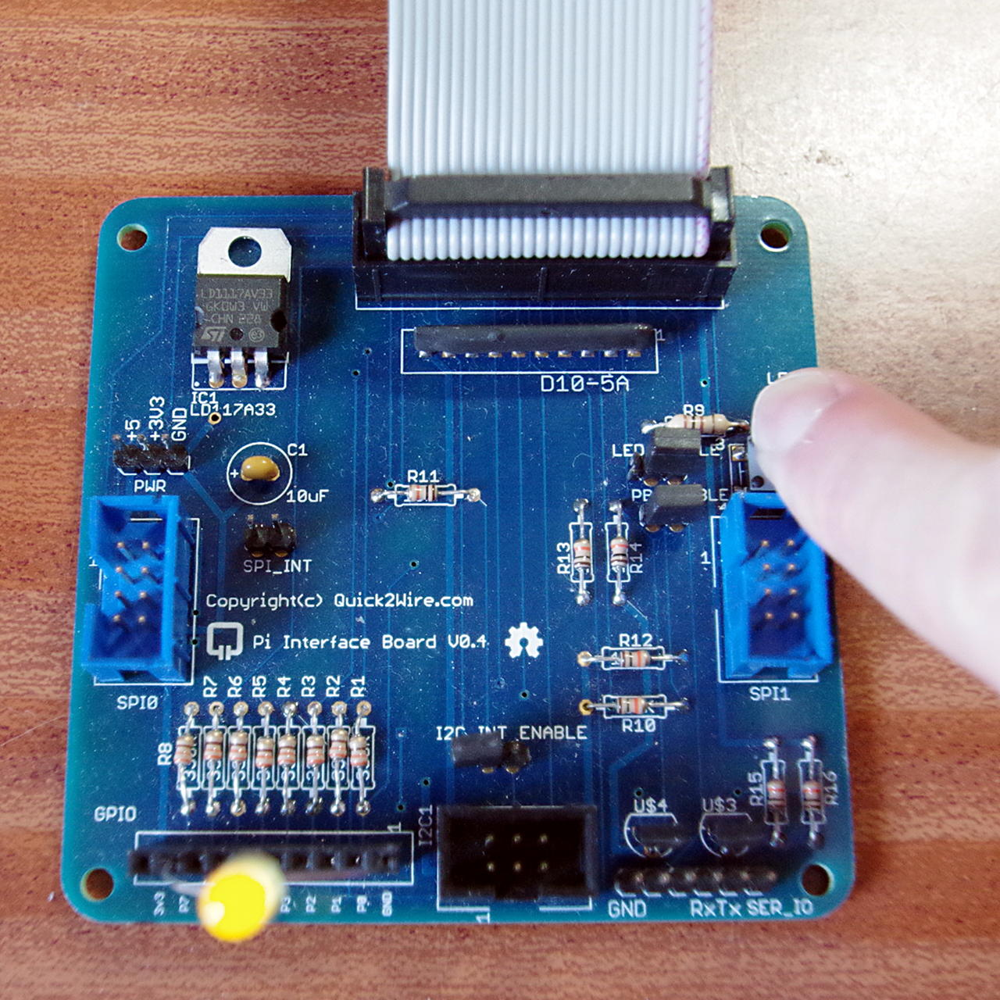

Install and Testing
Once I’d soldered it and checked to make sure no solder bridges, etc. I plugged it in to do some testing.

The main board has an LED and a button and these can be optionally jumpered into the GPIO pins. The two jumper links next to the LED and button need to be present to use them.

The button is connected to pin 0 and the LED to pin 1. The button is wired so that the input reads 1 when you push the button.

To test, make sure wiringPi is installed, then:

gpio mode 0 in  # Button pin 0
gpio mode 1 out # LED pin 1
while true; do gpio write 1 `gpio read 0`; done
Pushing the button should light the LED. If not, then check each one individually:

gpio write 1 1 # LED on
gpio write 1 0 # LED off
and for the button:

gpio read 0
should return 1 when you push the button, otherwise 0.

At the bottom of the main board is the external GPIO connector as well as some power and ground pins. The GPIO outputs have series resistors, so can be connected directly to LEDs – I connected an LED between 0v and pin7 and:

gpio mode 7 out
while true; do gpio write 7 `gpio read 0`; done
and used the button to toggle the LED on pin 7 in the same way as above.

q2w-t1Testing the board. LED is connected from pin 7 to GND (0v) Long leg to pin 7… Also note the jumpers next to the on-board LED and button near the middle-right of the board.

So the main board on its own is already quite versatile, and using BASH and the command line, we can perform some simple tests on it.

The standard “blink” program in C is:

#include <stdio.h>
#include <wiringPi.h>

#define LED     1

int main (void)
{
  printf ("Raspberry Pi Quick2Wire blink\n") ;

  wiringPiSetup () ;
  pinMode (LED, OUTPUT) ;

  for (;;)
  {
    digitalWrite (LED, HIGH) ;  // On
    delay (500) ;               // mS
    digitalWrite (LED, LOW) ;   // Off
    delay (500) ;
  }
  return 0 ;
}
Compile this with:

gcc -o blink blink.c -lwiringPi
and run:

sudo ./blink
Press Control-C to exit.

You’ll find this program along with all the others mentioned here in the q2w directory under the examples directory in the wiringPi source distribution.

If you don’t want to run a C program just yet, then via BASH:

while true; do gpio write 1 1 ; sleep 0.5 ; gpio write 1 0 ; sleep 0.5 ; done
This is blink.sh in the q2w directory.

Have a look at the button.c program too – that will light up the on-board (red) LED but when you push the button it will turn it off an light up an LED connected to pin 7 (as shown above with the yellow LED) Compile and rung this this by typing:

make button
sudo ./button
Or use the compilation commands as described abive.

Using this knowledge, it should be possible to use the Quick2Wire main board for some simple projects – using the on-board LED and button, and using the 8-way connector at the bottom to connect more LEDs and buttons.

Note: Remove the jumpers from the on-board LED and/or button if you wish to use pins 0 and 1 on the bottom connector.
 