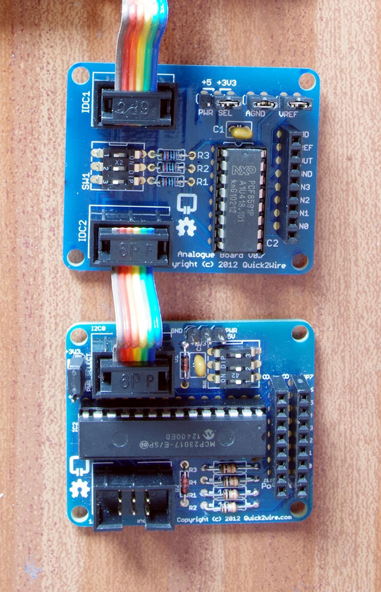

Testing the I2C modules
If you don’t have any I2C modules for the Quick2Wire system yet, then you may wish to skip this section.

q2w-t2The Quick2Wire 16-port digital (bottom) and 5-port analog interface boards (top)

To test the I2C interface boards you first need to make sure the Linux kernel I2C modules are loaded. Use wiringPi’s gpio command to load the modules if they are not auto-loaded.

gpio load i2c
You can either use the i2cdetect command, or use it via the gpio command which will take care of working out the differences between Raspberry Pi board revision 1 and 2.

gpio i2cd
The default address of the MCP23017 GPIO expander is 0x20 and the default address of PCF8591 Analog IO chip is 0x48. Obviously if you only have one or the other,  then you’ll see different results here, similarly if you’ve changed the jumper switches to alter the I2C address you may see different numbers here. (It may be beneficial to change the jumper switches at some point just to make sure they do what you expect them to do)

     0  1  2  3  4  5  6  7  8  9  a  b  c  d  e  f
00:          -- -- -- -- -- -- -- -- -- -- -- -- -- 
10: -- -- -- -- -- -- -- -- -- -- -- -- -- -- -- -- 
20: 20 -- -- -- -- -- -- -- -- -- -- -- -- -- -- -- 
30: -- -- -- -- -- -- -- -- -- -- -- -- -- -- -- -- 
40: -- -- -- -- -- -- -- -- 48 -- -- -- -- -- -- -- 
50: -- -- -- -- -- -- -- -- -- -- -- -- -- -- -- -- 
60: -- -- -- -- -- -- -- -- -- -- -- -- -- -- -- -- 
70: -- -- -- -- -- -- -- --
If you get the above then you’re well on your way to being able to use these boards. At least the chips are working with the I2C bus!

Note: If you have an early revision of the 16-pin IO board that the output pin numbers are reversed – ie. for pin 7, read pin 0, 6 -> 1, 5 -> 2 and so on.