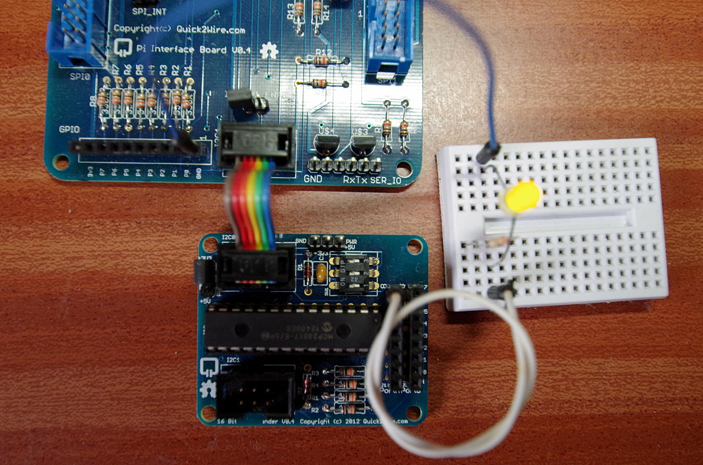

The 16-pin GPIO expansion board
If you don’t have any I2C modules for the Quick2Wire system yet, then you may wish to skip this section.

q2w-t3The Quick2Wire 16-pin digital expansion board with Port A, bit 0 connected via a 220Ω resistor to an LED.

The GPIO expansion board uses the MCP23017 GPIO expansion chip. This provides 16 additional IO pins which you can use in your own programs in exactly the same way you might use the Pi’s on-board GPIO pins.

Note: Unlike the 8 IO pins on the Quick2Wire main board, these IO pins do not have any sort of series resistors or over voltage protection, so take care to only connect them to 3.3v devices.
To do some tests, we’ll start with a single LED connected to Port A, bit 0. The circuit above uses a 220Ω resistor then the LED then a connection to the GND/0v pin on the main board.

The commands:

gpio -x mcp23017:100:0x20 mode 100 out
gpio -x mcp23017:100:0x20 write 100 1
gpio -x mcp23017:100:0x20 write 100 0
should turn the LED on then off again. If not, check that its wired up correctly – that the LED is the right way round and that the MCP23017 appears as address 0x20 in the output of the gpio i2cd command. (If it’s something other than 0x20 then substitute that for the 0x20 in the command above).

What those gpio commands are doing:

The -x flag tells gpio to use an expansion module – the mcp23017 in this instance. The parameters (separated by colons) for the mcp23017 module are the new pin base number (100 in this case), and the I2C address of the chip (0x20). At that point, you can issue most standard gpio commands.

We can use a variant of the button push script that we used in the testing on the main board too:

gpio mode 0 in
while true; do gpio -x mcp23017:100:0x20 write 100 `gpio read 0`; done
Blink
In the q2w directory in the wiringPi examples directory, you’ll find a program called blink-io.c – this is the blink program adapted to use the 16-bit GPIO expander board. This program will blink the on-board LED at the same time as the one connected to the IO expander board.

Study it to compare with the standard blink.c program. Compile and run with:

gcc -Wall -oblink-io blink-io.c -lwiringPi
sudo ./blink-io
Advanced testing
For more advanced testing, I have a small board with a block of 10 LEDs on and a little push-button switch:

The mcp23017 on the Quick 2 Wire boardHere is a variant of the program I used when testing wiringPi v2’s ability to use the mcp23017 GPIO expansion chip:

/*
 * binary.c:
 *      Using the Quick 2 wire 16-bit GPIO expansion board
 *
 * Copyright (c) 2012-2013 Gordon Henderson. <projects@drogon.net>
 ***********************************************************************
 */

#include <stdio.h>
#include <wiringPi.h>
#include <mcp23017.h>

#define Q2W_BASE        100

int main (void)
{
  int i, bit ;

// Enable the on-goard GPIO

  wiringPiSetup () ;

// Add in the mcp23017 on the q2w board

  mcp23017Setup (Q2W_BASE, 0x20) ;

  printf ("Raspberry Pi - Quick2Wire MCP23017 Test\n") ;

// On-board button Input:

  pinMode (0, INPUT) ;

// First 10 pins on q2w board as outputs:

  for (i = 0 ; i < 10 ; ++i)
    pinMode (Q2W_BASE + i, OUTPUT) ;

// Last pin as an input with the internal pull-up enabled

  pinMode         (Q2W_BASE + 15, INPUT) ;
  pullUpDnControl (Q2W_BASE + 15, PUD_UP) ;

  for (;;)
  {
    for (i = 0 ; i < 1024 ; ++i)
    {
      for (bit = 0 ; bit < 10 ; ++bit)
        digitalWrite (Q2W_BASE + bit, i & (1 << bit)) ;

      while (digitalRead (0) == HIGH)           // While pushed
        delay (1) ;

      if (digitalRead (Q2W_BASE + 15) == HIGH)  // Not Pushed
        delay (100) ;
    }
  }
  return 0 ;
}
This program is called binary.c in the q2w directory in the wiringPi examples directory. Compile and run with:

gcc -Wall -o binary binary.c -lwiringPi
sudo ./binary
Push the main button to stop the counter, and push the button on the LED board to make it go faster. The LED board is simply 10 LEDs and series resistors and a single push-button connected to the 0v/GND line.

Note that this program uses both buttons – the one on the main Quick2Wire board and the one on the little test board. The one on the main Q2W board returns 0 (or LOW) when not pushed and 1 (or HIGH) when pushed, but the one on the expansion board works the opposite way, and returns 1 when not pushed and 0 when pushed.

Summary
Using the Quick2Wire MCP23017 GPIO expander with wiringPi is as simple as telling wiringPi about the gpio expander, assigning it a new pin number base (for its 16 pins), then using digitalRead(), digitalWrite(), pinMode() as before.

