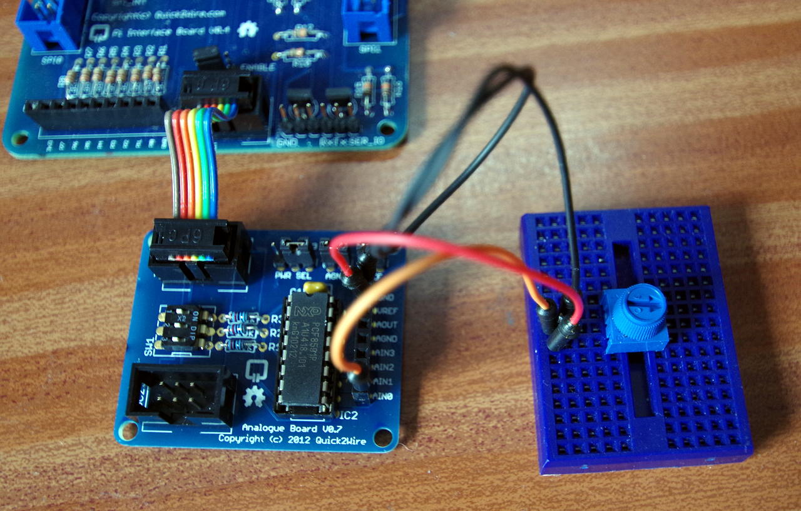

The Analog interface board
If you don’t have any I2C modules for the Quick2Wire system yet, then you may wish to skip this section.

q2w-t4The Quick2Wire analog interface board connected to a simple potentiometer for some analog input testing.

The analog expansion board uses the PCF5891 interface chip. This has a single digital to analog output channel and 4 analog to digital input channels. All channels are 8-bits wide.

To do some initial tests, I’ve connected a 10KΩ potentiometer between the ARef connection (3.3v) and the GND/0v connection. the wiper of the potentiometer is connected to Analog input pin 0.

We can use the gpio command to run some tests:

gpio -x pcf8591:120:0x48 aread 120
Or run it in a loop, and check that the reading goes from 0 to 255 when you move the potentiometer from one end to the other:

while true; do gpio -x pcf8591:120:0x48 aread 120 ; done
What this gpio command is doing:

The -x flag tells gpio to use an expansion module – the pcf8591 in this instance. The parameters (separated by colons) or the pcf8591 module are the new pin base number (120 in this case), and the I2C address of the chip (0×48). At that point, you can issue most standard gpio commands, although only the aread and awrite commands are applicable here.

You can check all 4 input channels this way and use the input to control various actions on your Pi – e.g this little program will configure the LED on the main board as PWM output and use the potentiometer to vary its brightness:

/*
 * bright.c:
 *      Vary the Q2W LED brightness with the analog card
 *
 * Copyright (c) 2012-2013 Gordon Henderson. <projects@drogon.net>
 ***********************************************************************
 */

#include <stdio.h>
#include <wiringPi.h>
#include <pcf8591.h>

#define LED               1
#define Q2W_ABASE       120

int main (void)
{
  int value ;

// Enable the on-goard GPIO

  wiringPiSetup () ;

// Add in the pcf8591 on the q2w board

  pcf8591Setup (Q2W_ABASE, 0x48) ;

  printf ("Raspberry Pi - Quick2Wire Analog Test\n") ;

// Setup the LED

  pinMode  (LED, PWM_OUTPUT) ;
  pwmWrite (LED, 0) ;

  for (;;)
  {
    value = analogRead  (Q2W_ABASE + 0) ;
    pwmWrite (LED, value * 4) ;
    delay (5) ;
  }

  return 0 ;
}
This program is called bright.c and you can find it in the q2w directory under the wiringPi examples directory. You can compile and run with:

gcc -Wall -o bright bright.c -lwiringPi
sudo ./bright
Analog Input Calculations
The analog input and output are 8-bit devices, so have a range of 0 to 255 when we read/write them. When using the normal 3.3v source as the reference voltage, then:

The input voltage is calculated as follows:

vIn = value * 3.3 ÷ 255

where value is the value we read from the converter using analogRead (). e.g. if we read a value of 172, then the input voltage is:

172 * 3.3 ÷ 255 = 2.23 volts.

Reading voltages
This program will read and print voltages from all 4 ports.

/*
 * volts.c:
 *      Read in all 4 analogs on the Q2W analog board.
 *
 * Copyright (c) 2012-2013 Gordon Henderson. <projects@drogon.net>
 ***********************************************************************
 */

#include <stdio.h>
#include <wiringPi.h>
#include <pcf8591.h>

#define Q2W_ABASE       120

int main (void)
{
  int value, pin ;

// Enable the on-goard GPIO

  wiringPiSetup () ;

// Add in the pcf8591 on the q2w board

  pcf8591Setup (Q2W_ABASE, 0x48) ;

  printf ("Raspberry Pi - Quick2Wire Voltmeter\n") ;

  for (;;)
  {
    for (pin = 0 ; pin < 4 ; ++pin)
    {
      value = analogRead  (Q2W_ABASE + pin) ;
      printf ("  %5.2f", (double)value * 3.3 / 255.0) ;
    }
    printf ("\r") ;
    fflush (stdout) ;
    delay (100) ;
  }

  return 0 ;
}
This program is called volts.c and you can find it in the q2w directory under the wiringPi examples directory. You can compile and run with:

gcc -Wall -o volts volts.c -lwiringPi
sudo ./volts
Unconnected inputs will probably read a random value, but as well as the potentiometer, you could connect up an LM35 temperature sensor – then you’ll see the temperature displayed as a voltage (divided by 100)

Analog Output
The easiest way to test the analog output is to connect a voltmeter (DVM) to it and set some values manually using the gpio command.

gpio -x pcf8591:120:0x48 awrite 120 127
should set it to the mid-value, so a voltmeter connected to the output pin should read 1.65 volts. On my board it’s reading 1.63 volts – close enough!

Analog Output Calculations
The output voltage is:

vOut = value ÷ 255 * 3.3

or to find the value for a chosen voltage:

value = vOut ÷ 3.3 * 255

here, value is the number we write using analogWrite (). e.g. to set an output voltage of 3 volts, then:

3 ÷ 3.3 * 255 = 232

So we’d write analogWrite (pin, 232); to set the output volrage to 3v.

Summary
The analog IO board provides a useful addition to the Quick2Wire system and can be used to read a variety of sensors from simple resistive light dependant resistors to analog temperature sensors – simple joystick inputs and so on. The analog output could be used to generate simple waveforms on an oscilloscope or for analog control (via suitable buffer/amplifiers) of motors, lights and so on.

It’s not the fastest of systems – the maximum sampling speed is going to be about 2000 samples/second and output update speed about double that. Not quite good enough for audio at those speeds but should be more than adequate to read various analog sensors and so on.