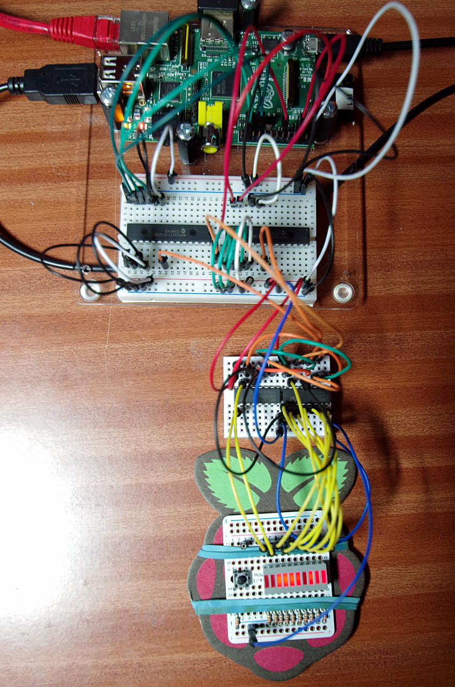

Testing wiringPi v2
Testing is always the hardest part of developing a project! WiringPi itself is fairly well tested, but the new additions needed additional testing, so my “stress test” was to integrate an MCP23S17 (SPI), MCP23017 (I2C) GPIO expanders and use them plus one bit from the Raspberry Pi’s own on-board GPIO to drive a pair of 74HC595 shift registers. The shift register module needs 3 pins, so one pin via SPI, one via I2C and one from the Pi’s on-board GPIO.

I connected up my little 10-LED module to the shift registers. Note that to set a single bit requires 10 clocks to be sent to the shift registers, so the setup isn’t exactly high performance, but it demonstrated that it was possible to have one expansion module use pins defined in other modules.

stressTestThis is the testing setup. The larger breadboard has the MCP23S17 (left) and the MCP23017 (right) on it, the smaller breadboard the pair or 74HC595 shift registers then the little protoplate has my LED array and button on it.

The program – here is where wiringPi v2 really makes its mark. No-longer do you have to poke bytes to configuration registers, enable the I2C or SPI buses (although you do need to load the kernel modules!) or work out how to change a single bit in a ‘595 shift register – wiringPi does all that for you. Once you create an instance of a device, it’s just more “pins” to be used with the existing digitalWrite(), digitalRead(), etc. functions.

/*
 * stress.c:
 *      WiringPi stress test
 *
 * Copyright (c) 2012-2013 Gordon Henderson. <projects@drogon.net>
 ***********************************************************************
 */

#include <stdio.h>
#include <wiringPi.h>
#include <mcp23s17.h>
#include <mcp23017.h>
#include <sr595.h>

// The first pin number for each device 

#define BASE_SPI        123
#define BASE_I2C        456
#define BASE_SR         789

int main (void)
{
  int i, bit ;

  wiringPiSetup () ;
  mcp23017Setup (BASE_I2C, 0x20) ;
  mcp23s17Setup (BASE_SPI, 0, 0) ;
  sr595Setup    (BASE_SR, 10, 0, BASE_SPI, BASE_I2C) ;

  printf ("Raspberry Pi - MCP23S17 + MCP23017 + 74x595 Test\n") ;

// For the push button to stop it...

  pinMode         (BASE_I2C + 15, INPUT) ;
  pullUpDnControl (BASE_I2C + 15, PUD_UP) ;

  for (;;)
  {
    for (i = 0 ; i < 1024 ; ++i)
    {
      for (bit = 0 ; bit < 10 ; ++bit)
        digitalWrite (BASE_SR + bit, i & (1 << bit)) ;
      delay (5) ;
      while (digitalRead (BASE_I2C + 15) == 0)
        delay (1) ;
    }
  }
  return 0 ;
}
More tests to come – especially analog.