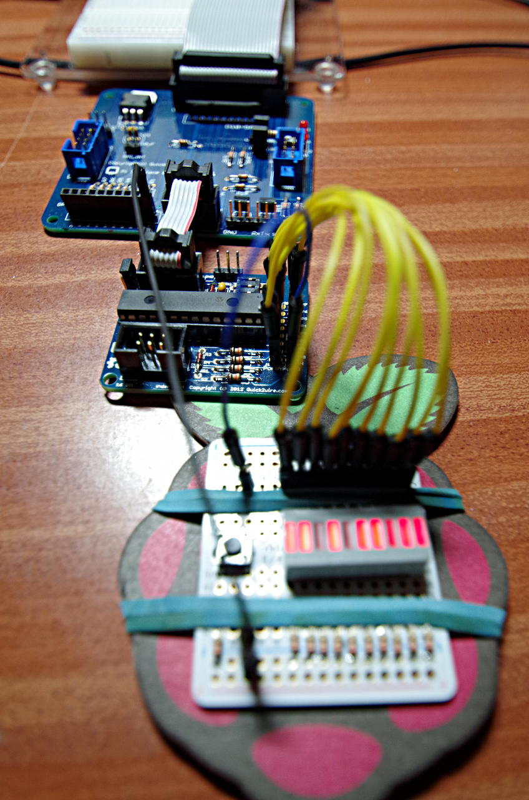

I2C: MCP23008 & MCP23017
WiringPi supports an extension module for the MCP23008 (8-bit) and MCP23017 (16-bit) I2C GPIO expansion chips.

The Raspberry Pi has one I2C bus and the MCP23008/MCP23017’s have a 3-bit address select port, so in-theory you can connect up 8 MCP23008/MCP23017’s giving you a GPIO capability of an additional 128 IO pins using these devices.

Include
#include <wiringPi.h>
#include <mcp23017.h>
and/or:

#include <mcp23008.h>
Initialise
mcp23017Setup (int pinBase, int i2cAddress) ;
and/or

mcp23008Setup (int pinBase, int i2cAddress) ;
The pinBase can be any number you like above 64 and the i2cAddress is the address of the device in the I2C bus (usually 0x20)  is the default but they can change if you have multiple devices. Use the i2cdetect command to probe your I2C bus to work out the right address to use.

You can call mcp23008Setup() and/or mcp23017Setup() as many times as needed for each MCP23008 or MCP23017 you have in the system – just give it a different pin base and I2C bus address.

You don’t need to specify the number of pins here – the MCP23008 has 8 pins and the MCP23017 has 16 pins.

The following photo shows an example in-use – it’s the Quick2Wire GPIO expander board which has a single MCP23017 fitted and all 16 IO pins brought out. I have connected a board with 10 LEDs and a button to it:

The mcp23017 on the Quick 2 Wire board

The program outputs a single 10-bit binary count and pauses when the button is pushed. The first 10 pins are configured as outputs and the last (15) is an input with the internal pull-up resistor enabled (the button connects to 0v)

/*
 * q2w.c:
 *      Using the Quick 2 wire board for its mcp23017
 *
 * Copyright (c) 2012-2013 Gordon Henderson. <projects@drogon.net>
 ***********************************************************************
 */

#include <stdio.h>
#include <wiringPi.h>
#include <mcp23017.h>

int main (void)
{
  int i, bit ;

  wiringPiSetup () ;
  mcp23017Setup (100, 0x20) ;

  printf ("Raspberry Pi - MCP23017 Test\n") ;

  for (i = 0 ; i < 10 ; ++i)
    pinMode (100 + i, OUTPUT) ;

  pinMode         (100 + 15, INPUT) ;
  pullUpDnControl (100 + 15, PUD_UP) ;

  for (;;)
  {
    for (i = 0 ; i < 1024 ; ++i)
    {
      for (bit = 0 ; bit < 10 ; ++bit)
        digitalWrite (100 + bit, i & (1 << bit)) ;
      delay (5) ;
      while (digitalRead (100 + 15) == 0)
        delay (1) ;
    }
  }
  return 0 ;
}
Notes
You need to load the I2C kernel modules before you can use I2C devices. Use the gpio command: gpio load i2c
Use the i2cdetect program to scan your I2C bus to make sure the Pi can see your devices. MCP23017’s will normally show up as 0x20, but when using multiple ones, they’ll each have a unique address (or should have!)
If you have a Rev 1 Pi, then the i2cdetect command is: i2cdetect -y 0 if you have a Rev. 2 Pi, then use i2cdetect -y 1
The gpio command supports the i2cdetect command and automatically caters for board revision. Simply type: gpio i2cd
The wiringPi MCP23008/MCP23017 driver knows which revision Pi you have, so you know need to take any special precautions – your code will work on either a Revision 1 or 2 Pi.
The MCP23008 and MCP23017 only have internal pull-up resistors.
The maximum current sourced of sunk on any pin is 25mA, however the chip can only source a maxmum on 125mA or sink a maximum of 150mA.