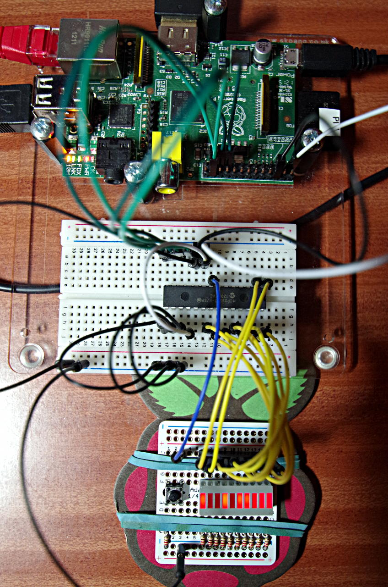

SPI: MCP23s08 & MCP23s17
WiringPi supports an extension module for the MCP23s08 (8-bit) and the MCP23s17 (16-bit) SPI GPIO expansion chips.

The Raspberry Pi has one SPI bus with two enable or select signals. The MCP23s08 and MCP23s17’s have 3 address select bits so in-theory you can connect up to 8 MCP23s08 and MCP23S17’s on the same SPI select signal giving you a GPIO capability of an additional 128 pins per SPI select signal when using these devices. (or double that if you use 8 more on the 2nd SPI select)

Include
#include <wiringPi.h>
#include <mcp23s17.h>
or

#include <mcp23s08.h>
Initialise
mcp23s17Setup (int pinBase, int spiPort, int devId) ;
or

mcp23s08Setup (int pinBase, int spiPort, int devId) ;
pinBase is any number above 64 that doesn’t clash with any other wiringPi expansion module, spiPort is 0 or 1 for one of the two SPI ports on the Pi and devId is the ID of that MCP23x08 or MCP23s17 on the SPI port.

You don’t need to specify the number of pins here as the MCP23s08 has 8 pins and the MCP23s17 has 16 pins.

The following photo shows it in-use with an MCP23S17 on a breadboard connected to a Pi. The green wires are the SPI connections, then it’s just power and ground (white, black) The test board is connected to pins 0 through 11 and the button to pin 15 in the same way as the MCP23017 I2C example.

mcp23s17 SPI GPIO expanderNote the 3 black wires to the bottom-left. These are connecting the A0, A1 and A2 pins to 0v, giving a chip-id (devId) of 0.

The test program is virtually identical to the MCP23017 I2C example:

/*
 * 23s17.c:
 *      WiringPi test with an MCP23S17 SPI GPIO expander chip
 *
 * Copyright (c) 2012-2013 Gordon Henderson. <projects@drogon.net>
 ***********************************************************************
 */

#include <stdio.h>
#include <wiringPi.h>
#include <mcp23s17.h>

#define BASE    123

int main (void)
{
  int i, bit ;

  wiringPiSetup () ;
  mcp23s17Setup (BASE, 0, 0) ;

  printf ("Raspberry Pi - MCP23S17 Test\n") ;

  for (i = 0 ; i < 10 ; ++i)
    pinMode (BASE + i, OUTPUT) ;

  pinMode         (BASE + 15, INPUT) ;
  pullUpDnControl (BASE + 15, PUD_UP) ;

  for (;;)
  {
    for (i = 0 ; i < 1024 ; ++i)
    {
      for (bit = 0 ; bit < 10 ; ++bit)
        digitalWrite (BASE + bit, i & (1 << bit)) ;
      delay (5) ;
      while (digitalRead (BASE + 15) == 0)
        delay (1) ;
    }
  }
  return 0 ;
}
Notes
You need to load the SPI kernel modules before you can use SPI devices. Use the gpio command: gpio load spi
The MCP23s08 and MCP23s17 only have internal pull-up resistors, not pull-down.
The maximum current sourced of sunk on any pin is 25mA, however the chip can only source a maxmum on 125mA or sink a maximum of 150mA.
If you are using more than one chip, then you must make sure that each one has a unique devId (set by the A0, A1 and A2 pins on the chip), and initialise each one in-turn. Failure to do this will result in multiple chips working at the same time which is probably not what you want!