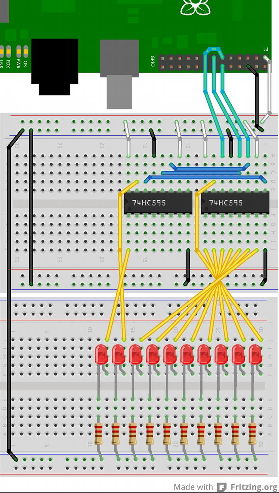
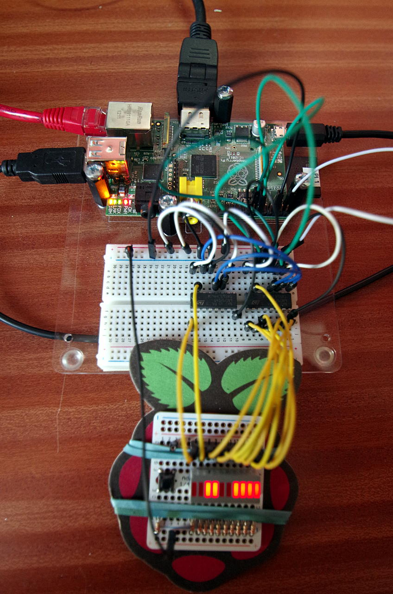

Shift Register: 74×595
WiringPi supports an extension module for the 74×595 shift register chips which can be used as general purpose output ports.

Each instance can support up to 4 74×595’s daisy-chained together, giving a 32-bit output port using just 3 GPIO wires from the Raspberry Pi (Or from any other GPIO expansion port connected to the Pi) You can have as many instances of these enabled in your system, providing you have 3 spare GPIO pins per instance.

Include
#include <wiringPi.h>
#include <sr595.h>
Initialise
sr595Setup (pinBase, numPins, dataPin, clockPin, latchPin) ;
pinBase is the base pin that you want your shift registers to appear at. The example below uses 100. numPins here can be from 1 to 32 – 8 pins per 74×585.

The dataPin is connected to the DS pin (14), the clockPin is connected to the SHCP pin (11) and the latchPin is connected to the STCP pin (12).

If connecting more 74×595’s together then you connect the SHCP and STCP pins together and the Q7S output pin (9) to the DS pin on the next one up the line. Data bit zero is Q0 on the first 74×595.

Pins MR (10) should be connected to Vcc, OE (13) connected to 0v, Pin 16 is Vcc and 8 is 0v/Ground.

The following diagram gives an example with 2 74×595’s connected to 10 LEDs:

74HCT595 Shift Registers

And the following is a photograph of the actual implementation of the above:

74x595 Shift Regsiters

The following program puts a binary count of the LEDs:

/*
 * sr.c:
 *      Shift register test program
 *
 * Copyright (c) 2012-2013 Gordon Henderson. <projects@drogon.net>
 ***********************************************************************
 */

#include <stdio.h>
#include <wiringPi.h>
#include <sr595.h>

int main (void)
{
  int i, bit ;

  wiringPiSetup () ;

// Pin base 100 for 10 pins.
//    Use wiringPi pins 0, 1 & 2 for data, clock and latch
  sr595Setup (100, 10, 0, 1, 2) ;

  printf ("Raspberry Pi - Shift Register Test\n") ;

  for (;;)
  {
    for (i = 0 ; i < 1024 ; ++i)
    {
      for (bit = 0 ; bit < 10 ; ++bit)
        digitalWrite (100 + bit, i & (1 << bit)) ;
      delay (5) ;
    }
  }
  return 0 ;
}
Notes
When first powering up, the 74×595 will be in a random state – it may not be wise to rely on any particular setting and so explicitly setting all outputs to zero, or whatever value is needed might be wise.
The sr595 module takes care of doing all the shifting and remembering which bits are already set an which are clear for you. You just use digitalWrite() as before. (Calls to pinMode(), etc. have no effect)
sr595Setup() calls pinMode() and digitalWrite() on the 3 pins supplied. These pins must be output capable, but can be any 3 pins – e.g. the Pi’s on-board GPIO or additional GPIO provided via expansion modules. You can even use an existing registered sr595 instance to drive additional chains, although it’s not recommended!
Each call to digitalWrite() will do a complete shift of all bits out through the shift-register. If the 74×595 is directly connected to the Pi’s GPIO then each bit write takes 2µS plus an additional 2µS per latch. It should be “fast enough”, but do bear this in-mind when shifting out big strings of bits – ie. 4 daisy chained together into a 32-bit register will take 32 x 2 + 2 = 66µS per update. It may be slightly slower if you connect the 74×595’s to another GPIO expander.
You can power the 74×595 from 5v rather than 3.3v if required. There are no inputs back to the Pi so it should be fine.